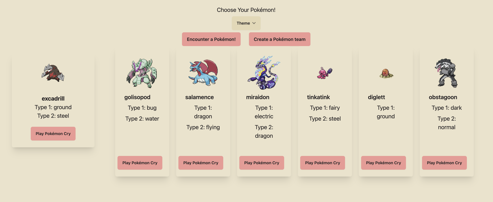

# Pokémon Encounter and Team Generator

## What is this project?
This project is a Pokémon-themed web application that allows users to interact with Pokémon data dynamically. 
It has two main features:

- Single Pokémon Encounter: 
	- This section of the application displays detailed information about a single Pokémon. Users can view a Pokémon's image, name, and type(s). Additionally, there's functionality to play the Pokémons 'cry'.

- Pokémon Team Creation: 
	- In this part of the application, users can generate and view a team of Pokémon. This area allows for multiple Pokémon to be displayed together, each represented in a card format which includes their images, names, types, and an option to hear their specific cry.

The layout is responsive, making it suitable for both mobile and desktop devices. On mobile devices, the sections stack vertically with the single Pokémon display on top, followed by the team display below, allowing users to scroll through content seamlessly. On desktops, these sections are displayed side-by-side, with the single Pokémon details appearing in a sidebar.

## What does this project use?
- HTML
- CSS/Tailwind CSS + DaisyUI
- JavaScript
- External Pokémon API - [PokeAPI](https://pokeapi.co/)

### Deployment:
[Netlify](https://x-pokemon-generator.netlify.app/)

## To-Do 
- [x] Cries
- [x] Shiny chance
- [x] Team generator
	- [ ] select number of Pokemon to generate in the team 

